# Pipeline Flowcharts

These diagrams use Mermaid and are organized around four blocks:

- `Document block`
- `Retrieval block`
- `Answering block`
- `Reasoning & orchestration block`

## Shared Block View

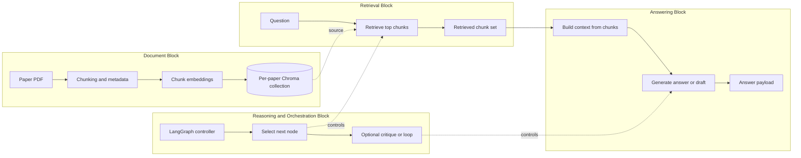

## Document Block Variants

### P0 Document Block

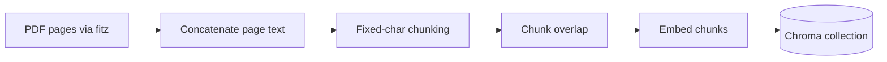

### P1 to P5 Document Block

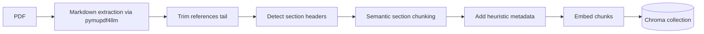

## Pipeline Versions

### P0 Baseline

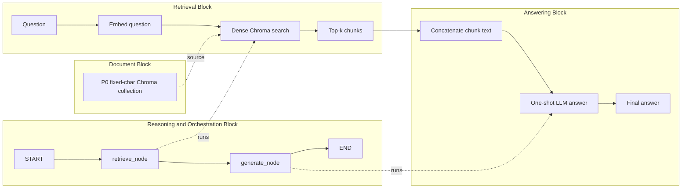

### P1 Semantic Chunking

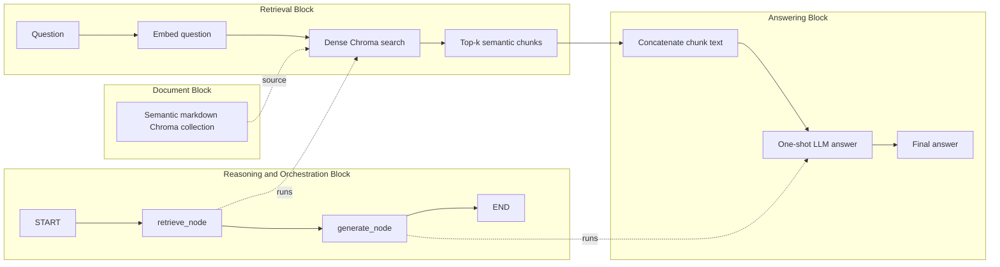

### P2 Hybrid Retrieval

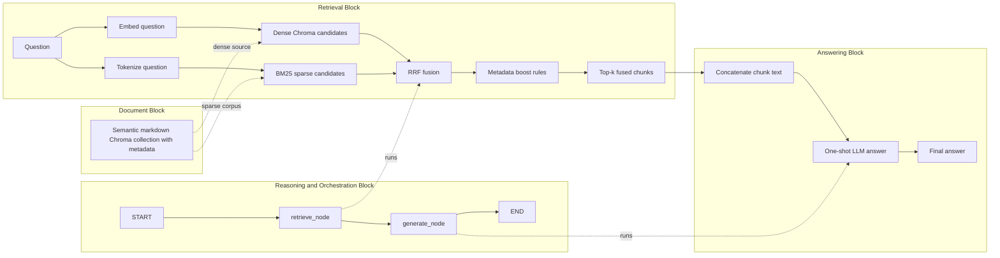

### P2 Improved Adaptive Hybrid

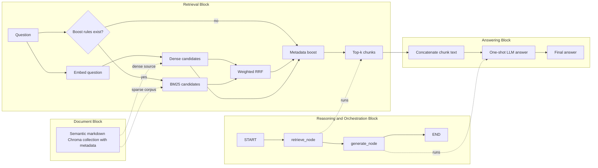

### P3 Adaptive Multi-Query Structured QA

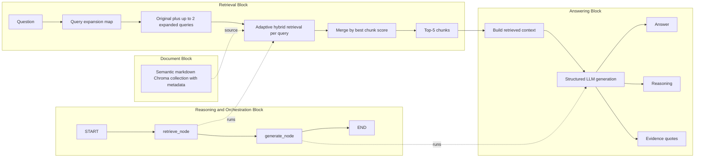

### P4 Draft Plus Conditional Critic

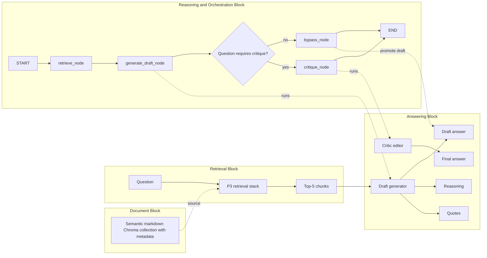

### P5 Ver1 Autonomous Critic Loops

```mermaid
flowchart TD
    subgraph D["Document Block"]
        p5d[Semantic markdown Chroma collection with metadata]
    end

    subgraph R["Retrieval Block"]
        p5r1[Question or critic search query]
        p5r2[Adaptive hybrid retrieval]
        p5r3[Merge new chunks with prior chunks]
        p5r4[Current evidence set]
        p5r1 --> p5r2 --> p5r3 --> p5r4
    end

    subgraph A["Answering Block"]
        p5a1[Drafter]
        p5a2[Draft answer]
        p5a3[Reasoning]
        p5a4[Quotes]
        p5a1 --> p5a2
        p5a1 --> p5a3
        p5a1 --> p5a4
    end

    subgraph O["Reasoning and Orchestration Block"]
        p5o1[START]
        p5o2[retrieve_node]
        p5o3[generate_draft_node]
        p5o4[critique_node]
        p5o5{Critic status}
        p5o6[ACCEPT]
        p5o7[REVISE]
        p5o8[RE_RETRIEVE]
        p5o9[ABSTAIN]
        p5o10[END]

        p5o1 --> p5o2 --> p5o3 --> p5o4 --> p5o5
        p5o5 --> p5o6 --> p5o10
        p5o5 --> p5o7 --> p5o3
        p5o5 --> p5o8 --> p5o2
        p5o5 --> p5o9 --> p5o10
    end

    p5d -. source .-> p5r2
    p5r4 --> p5a1
    p5o2 -. runs .-> p5r2
    p5o3 -. runs .-> p5a1
    p5o4 -. may add feedback or query .-> p5o5
```

## Evolution Summary

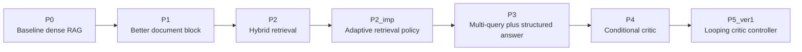
